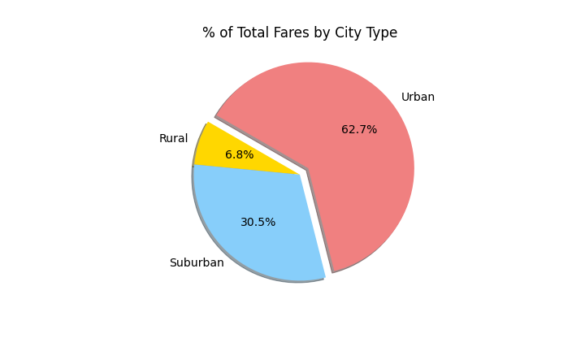
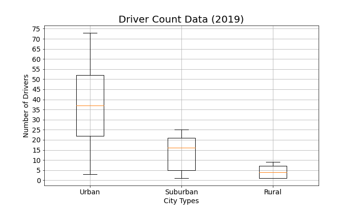
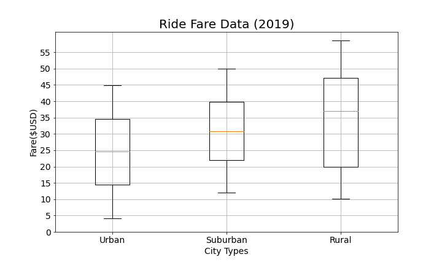
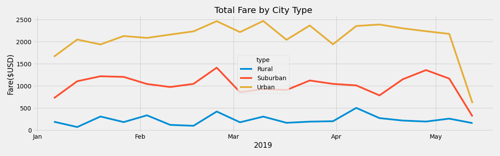

# Overview

We have performed this analysis to visualize the ride-sharing data by city type. We have created a multiple-line graph that shows the total weekly fares for each city type. We have also summarized how the data differs by city type and how those differences can be used by decision-makers at PyBer.

# Results

- The pie chart below shows that urban cities get the most percentage of total fares followed by suburban.

- The pie chart below shows that that urban cities have the most percentage of total rides followed by suburban.

- The pie chart below shows that that urban cities have the most percentage of total drivers followed by suburban.

- Bubble chart below showcases the average fare versus the total number of rides with bubble size based on the average number of drivers for each city type: urban, suburban, and rural. Urban cities have more rides and average number of drivers than suburban and rural cities in that order. However, the average fare is in the opposite order:
highest for rural, lowest for urban and suburban in between.

- Below Box and Whisker plot shows that the average number of drivers in the rural cities is about 9- and 4-times lower per city than the urban and suburban cities, respectively

- Below Box and Whisker plot shows that the average number of rides in the rural cities is about 4- and 3.5-times lower per city than the urban and suburban cities, respectively. 

- Below Box and Whisker plot shows that the average fare for rides in the rural cities is about $11 and $5 more per ride than the urban and suburban cities, respectively. This difference maybe due to fewer number of rides and drivers as seen in the above plots.

- We have created a multiple-line graph below that shows the total weekly fares for each city type. The weekly fares for urban cities is the most followed by suburban and rural.

# Summary

Based on our analysis we have the following business recommendations for the CEO of PyBer:
1. You should consider decreasing the fare for rural cities so that the average fare for the customer is closer to the suburban and urban cities.
2. In order to provide a better average fare, it might be best to increase the number of drivers significantly for rural cities and slightly for suburban cities so that it is closer to the number of drivers in urban cities.
3. In order to generate the demand for more rides in rural and suburban cities, it might be a good idea to use advertisements and other marketing campaigns to raise consumer awareness. 
